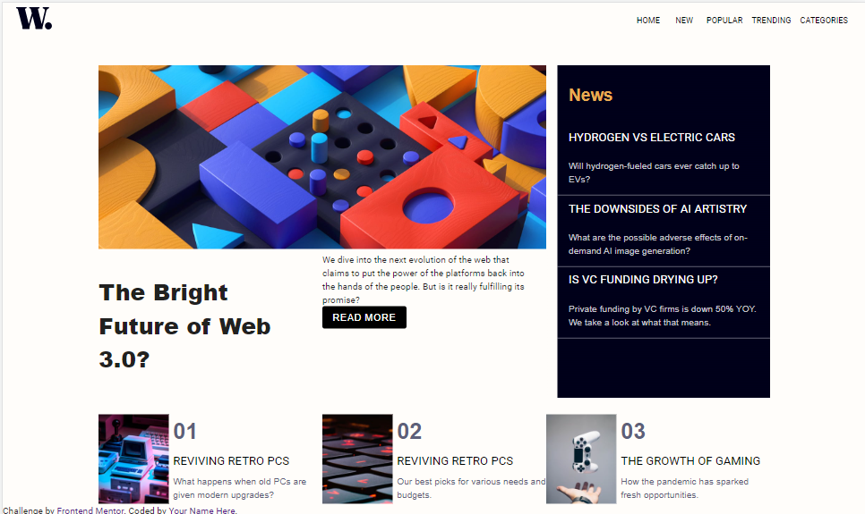

# Frontend Mentor - News homepage solution

This is a solution to the [News homepage challenge on Frontend Mentor](https://www.frontendmentor.io/challenges/news-homepage-H6SWTa1MFl). Frontend Mentor challenges help you improve your coding skills by building realistic projects. 

## Table of contents

- [Overview](#overview)
  - [The challenge](#the-challenge)
  - [Screenshot](#screenshot)
  - [Links](#links)
- [My process](#my-process)
  - [Built with](#built-with)
  - [What I learned](#what-i-learned)
  - [Continued development](#continued-development)
  - [Useful resources](#useful-resources)
- [Author](#author)
- [Acknowledgments](#acknowledgments)

**Note: Delete this note and update the table of contents based on what sections you keep.**

## Overview

### The challenge

Users should be able to:

- View the optimal layout for the interface depending on their device's screen size
- See hover and focus states for all interactive elements on the page

### Screenshot



### Links

- Solution URL: [https://www.frontendmentor.io/solutions/build-up-homepage-by-react-and-mui-dDSzMJnBfg](https://www.frontendmentor.io/solutions/build-up-homepage-by-react-and-mui-dDSzMJnBfgm)
- Live Site URL: [https://master--silver-twilight-99257b.netlify.app/](https://master--silver-twilight-99257b.netlify.app/)

## My process

1. Imaging that I would get data from back-end in the future, so I saved the information about news in `rank-news.js` and `sub-news.json`

2. My html in react may look like this:

```
<Navbar/>
<Main>
  <Mainnews/>
  <Subnews/>
</Main>
<Ranknews/>

```

3. I find a proper Navbar in [MUI](https://mui.com/material-ui/react-app-bar/), and change the `title name` and `image` in the default code.

4. Finish `Main` part with grid method from [MUI](https://mui.com/material-ui/react-grid/), and use `map()` to print the element in `json` file at the begining. And `Ranknews` is in the same way.

5. Adjust picrute size and block size for the mobile by `MediaQuery` in react( you can also find this in [MUI](https://mui.com/material-ui/react-use-media-query/))

6. Adjust `font-family`,`background`.... Make sure the page looks right!


### Built with


- [React](https://reactjs.org/) - JS library
- [Next.js](https://nextjs.org/) - React framework
- [MUI](https://mui.com/)


### What I learned

- This is my first time to use MUI, I don't need to write all the componet from the begining and that save lots of time!
- After import code from the framework, you should learn how to customize the look you need.
- It's my second project in front-mentor, and I used to edit css in `App.js`. Since the project become more and more complexive, it seems that I should manage all the css in a smarter way.
- It may be difficult to import lots of image from react 
- It takes less time compared with the last project :D


### Continued development

- Personal Main Page
- Collect and shows news in some way


### Useful resources

- [React How to get data from JSON](https://stackoverflow.com/questions/42854494/how-do-i-retrieve-images-from-json-into-react) - This helped to get data.

**mui-component**

- [Button](https://mui.com/material-ui/react-button/)
- [Navbar](https://mui.com/material-ui/react-app-bar/)
- [Theme](https://mui.com/material-ui/customization/theming/) - you can customer your color in this way
- [MUI image](https://mui-image.surge.sh/) - this is used to cut the image
- [Grid](https://mui.com/material-ui/react-grid/) - help to put element in the right position


## Author

- Website - [Chious](https://github.com/Chious)
- Frontend Mentor - [@Chious](https://www.frontendmentor.io/profile/Chious)
- Twitter - [@Chious](https://twitter.com/ChiouJiaSheng)

## Acknowledgments

Nope